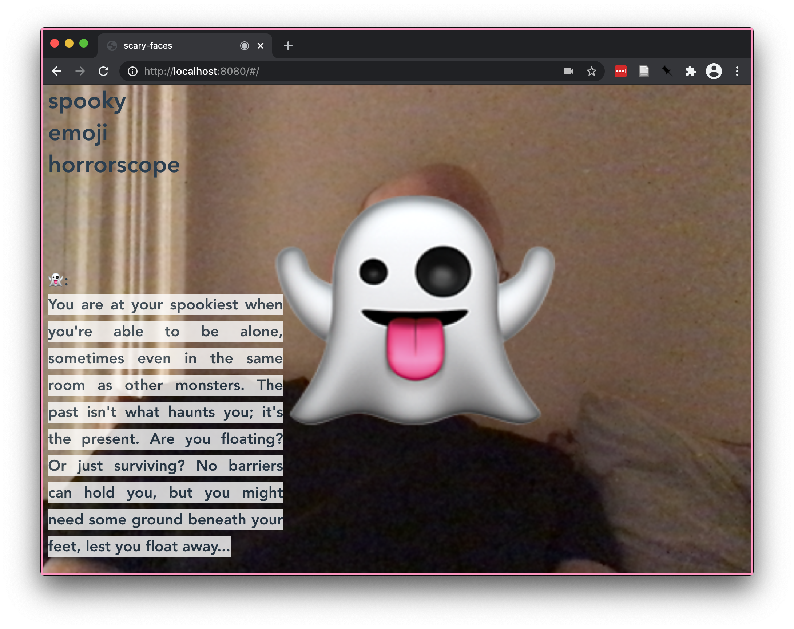

# horrorscope

Horrorscope uses face recognition and analysis to intuit the spooky emoji at your
core. screw constellations -- are you a ghost, a coffin, a jack-o-lantern, or a moon?

      `emojis: ["👻", "💀", "🕷","⚰", "🌕","🎃", "🦇"`

inspired by the deluge of bad facial recognition and classification research out there, i wore this
app on an ipad as part of my 2019 halloween costume, where I promised people that my proprietary,
SOTA face recognition algorithm could tell them their true emoji from just their face.

horrorscope remembers faces it sees and replaces each face from a camera with its corresponding
emoji. the horoscopes themselves are all the same -- for now.

